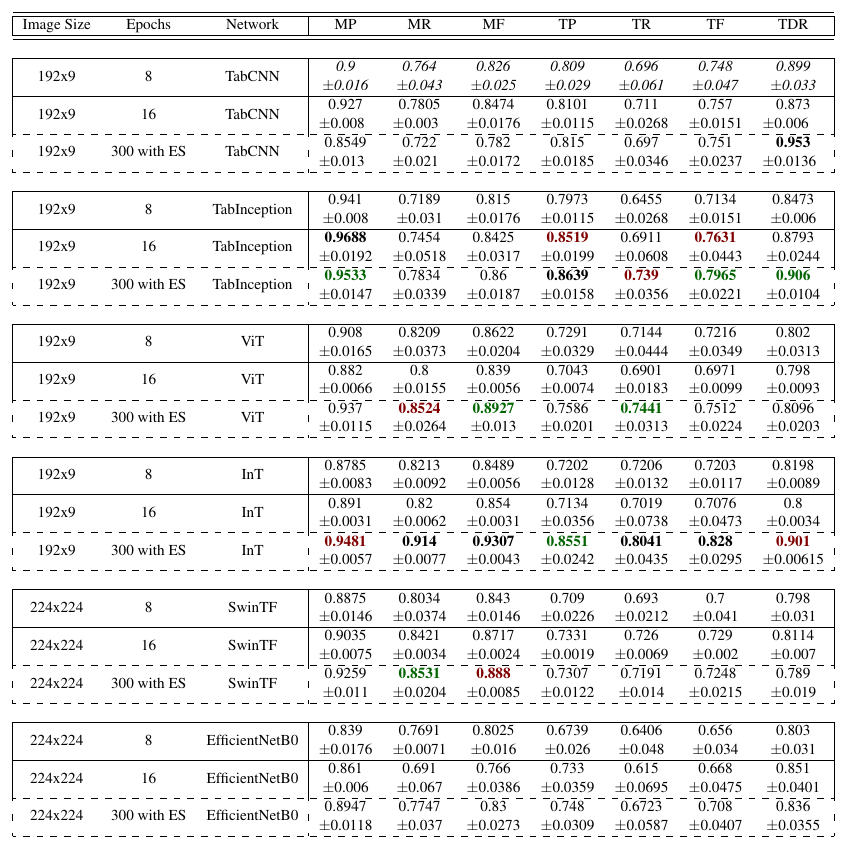

# Leveraging Computer Vision Techniques for Guitar Tablature Transcription


### Requirements

This project was made to be run with Python 3.9. You should have the following libraries/packages installed:
* numpy
* scipy
* pandas
* jams
* librosa
* keras
* tensorflow

```pip install -r requirements.txt```

### 1. Download dataset

Download the GuitarSet audio and annotation data from [here](https://zenodo.org/record/1422265/files/GuitarSet_audio_and_annotation.zip?download=1 "GuitarSet download").

Unzip and place the downloaded GuitarSet folder in `code_12095/data/` so that in `code_12095/data/GuitarSet/` you have the following two folders:
* `annotation/`
* `audio/`

The remaining instructions assume that you are in the `code_12095/` folder.

### 2. Preprocessing

#### Compute the Constant-Q Transform on the audio files
Run the following line to preprocess different spectral representations for the audio files: 

  `bash data/Bash_TabDataReprGen.sh`

This will save the preprocessed data as compressed numpy (.npz) files in the `data/spec_repr/` directory.

#### Convert the NPZ files to tfrecords

Run either the `np_to_tfrecords_192x9.py` or `np_to_tfrecords_224x224.py` to slice your computed CQT features into images of size 192x9. The output of the first code would be the images of size 192x9 with their corresponding labels. The output of the second one would be the images of size 224x224 with their corresponding labels.

### 3. Training

In this repository, we offer an implementation of the EfficientNetB0, the SwinTransformer,the Vision Transformer, and the TabInception model in tensorflow for automatic guitar transcription using the GuitarSet dataset.

Run the following command to train the TabInception model:

`python model/TabInception_tfrec_192x9.py`

Run the following command to train the Inception Transformer (InT) model:

`python model/InT_tfrec_192x9.py`

Run the following command to train the Vision Transformer model:

`python model/VIT_tfrec_192x9.py`


Run the following command to train the EfficientNetB0 model:

`python model/EfficientNetB0_tfrec_224x224.py`

Run the following command to train the SwinTransformer model:

`python model/Swin_tfrec_224x224.py`

#### NB: All the training models show the 8 or 16 epochs configuration presented in the paper, except the configuration of InT model where we manifest the 300 epochs configuration with the early stopping mechanism.

### 4. Evalutation

A summary log and a csv results file will be saved in a time-stamped folder within the `model/saved/` directory. Additionally, a folder for each fold of data will be created, containing the individual model's weights and predictions. 

### 5. Experimental results



#### 5.1 Hyper-parameters

All the hyper-parameters presented in the code are fixed and will not change except the epoch size, as well as the early stopping (ES) mechanism when applied. We use a patience value of 5 for all the training with an early stopping mechanism.

#### 5.2 Training and evaluation runs

The image shown above presents all the experimental results performed in our paper.
Both training and testing runs were repeated 5 times.
The results shown in the table consist of the average number of all 5 runs.


##### 5.2.1 Runtime
The average runtime depends greatly on the model used as well as the number of epochs in question.

As for our experiment, we present below the average runtime per epoch size while giving a variance of 5 additional or reduced training hours regarding the model choice.

- 8 epochs: up to 20 hours
- 16 epochs: up to 48 hours
- 300 epochs with ES: up to 120 hours

##### 5.2.2 Computing infrastructure

For these experiments, we use the NVIDIA Tesla V100 SXM2 32GB graphics processing unit (GPU).
Since we trained different networks with different parameters, it was needed to use up to 4 GPUs simultaneously in some cases to train a specific model.
For instance, the proposed networks can be trained on a single GPU. Contrarily, the Swin Transformer (SwinTF) need more than 1 GPU to be trained.


